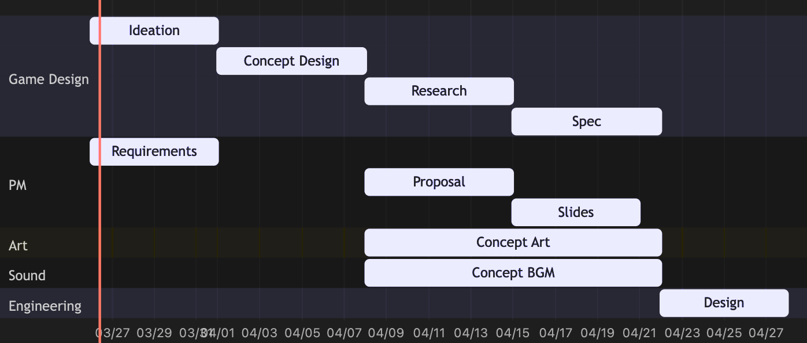

# 3월 26일 수요일 정기 회의
- 일시: 2025년 3월 26일 수요일 20:20-21:00
- 참여자: 김지원, 사푸트라, 오정택, 윤민, 정주은 (전원 비대면)
- 회의가 끝나기 전에 바쁠 경우 떠나기 **5분 전에 공지**하거나 **다음 회의 내용을 숙지**할 것을 권장
## 프리 스프린트 간트 차트 논의
스프린트 시작 전(4월 28일 이전)에는 최소한 다음 과정을 완료해야 함.
- **아이디에이션**으로 만들 게임 컨셉 결정, 요구사항 정의, 팀 이름 결정
- **컨셉**을 게임 디자인 문서 형식으로 정리하여 팀원 간의 게임에 대한 비전 공유, 프로젝트 제안 문서 작성 준비
- **프로젝트 제안 문서** 준비. 초안과 완성본을 각각 제출해야 함. **프로젝트 중간 발표** 슬라이드도 6-8 슬라이드 이내로 정리해야 함.
  - 스프린트 1을 진행하기에 앞서 필요한 프로덕트 백로그 등의 문서도 준비할 것.
- **스프린트 1**에 **구현할 사항의 명세**를 게임 디자인 문서로 정리.
- 해당 명세를 바탕으로 **프로젝트 진행에 필요한 준비**와 명세를 구현하기 위한 **코드 구조와 인터페이스를 설계**해야 함.
- 컨셉 디자인 문서의 내용을 보완하고 내용을 공유하기 쉽게 하기 위해 컨셉 아트와 컨셉 사운드가 어느정도 필요함.

이와 같은 일정이 다음 간트 차트로 시각화되어 있음. 이를 바탕으로 WBS 차트로 일감 단위로 나누고 분배할 예정. 이 일감을 **Trello** 카드로 다룰 예정임.

## Trello 칸반 보드 온보딩
- 칸반(Kanban)이란? — https://asana.com/resources/what-is-kanban
  - 일감을 작은 단위로 다루는 방법
  - 우선순위와 중요도를 labeling할 수 있다
  - 각 일감을 진행 단계와 기능 별로 분류하여 관리
  - 검색해 보거나 해당 링크를 참고하여 칸반 워크플로우를 익힐 것
- 초대 링크 (Slack 채널에 공유)
- Workflow를 참고하여 Template으로 신규 일감 카드를 Waitlist 보드에 추가
- 이후 진행도에 따라 다루기. 완료된 일감은 Done에 추가
- 주기적으로 workspace를 export하여 기록 예정
## 각 파트 별 회의 일정과 스터디 일정 논의
참고자료: 지난 회의(3월 24일)의 파트 별 스터디 조사 내용
- https://github.com/SWPP-2025SPRING/team-project-for-2025-spring-swpp-team-04/blob/main/meetings/2025-03-24-general.md (**스터디 수요 조사** 문단)
### 아트
- 일정은 추후 아티스트가 확보되는 시점에 논의
- 게임 디자인 문서를 참고한 **아트 디렉션**, **애셋 구현 목록** 논의, 작업 할당, 작업 내용 피드백
- **블렌더 과제 퀄리티가 우수할 경우**, 작업 시간 중 일부를 **아트에 기여할 것을 권장**
  - 아티스트가 부족한 경우, 이후 회의에서 **전수조사 예정**
- SNUGDC 2024년 1학기 교육 자료 중 발췌하여 스터디 진행 논의
### 게임 디자인
- 각 스프린트 별 브레인스토밍: **한정된 개발자원**으로 인해 **Sprint Planning Meeting**으로 갈음/대신함
- 할당된 유저 스토리나 컨텐츠를 디자인해 오면, 회의에서 논의 및 피드백 후 실제 디자인 명세로 확정
### 프로그래밍
- **매주 월요일 대면 회의 시간** 혹은 수요가 많은 시간대에 프로그래밍 회의 진행 예정
  - **5명 모두 참여** 예정
  - 스프린트 구현을 위한 설계 내용 논의, 작업 할당, 작업 내용 피드백
- Unity 수업과 무료 튜토리얼을 공부할 때 있는 **질문 사항을 수시로 답변 중** 
- **Unity practice**: 수업에서 커버하는 4시간의 실습과 2개의 과제에서 다루기 힘든,
  - OOP/DI
  - 이벤트 지향 프로그래밍
  - 안전한 프로그래밍
  - 예외 처리, 테스팅 등을 주로 스프린트 이전과 스프린트 1 초반 이내에 다룰 계획
- **페어 프로그래밍** 참여자 논의: 작업 생산성이 증가하여 적은 시간에 더 많은 기여를 인정받는 데 도움이 되며, **스프린트 1**에는 **반드시 참여자가 있어야 함**
## 1차 아이디에이션
### 오늘 나온 아이디어
시간 관계로 논의 없음. 다음 회의의 **2차 아이디에이션**으로 갈음
### 점검사항
방금 나온 아이디어에서 각각 다음과 같은 요소를 고려해 봐야 함.
- 각 게임의 재미요소 구현 우선순위 정하기 (핵심 기능, 추가 기능)
- 예상되는 재미와 구현의 현실성을 바탕으로 재미요소 마다 점수 매기기 (1-5점)
- 지적된 문제를 2차 아이디에이션까지 고쳐오기
### 피드백
(없음)
## 다음 회의 일정
다음 회의(03-31 대략 20:00 이후)에서는 2차 아이디에이션을 진행함. 그리고 WBS 차트 공유, 프리 스프린트 일감 경매 및 할당 외 사항을 진행할 예정임.
### 2차 아이디에이션
- 피드백 반영 결과를 바탕으로 프로젝트 제안 문서에 제출하고 **제작할 게임 확정**
- 게임과 팀의 성격과 관련 있는 **팀 이름 잠정 확정**
### WBS 차트와 프리 스프린트 일감 경매
- 간트 차트에서 언급된 작업들을 일감 단위로 나눈 WBS 차트 (프리 스프린트) 공유
- 일감들을 Trello 보드에서 희망자는 채가거나, 스킬을 고려하여 **임의로 할당** 예정
- 프리 스프린트 기간 (약 4주) 동안 한 명의 팀원에게 기대되는 작업량은 (회의 일정 제외) 대략 6-10시간 정도 (~ 주 2-3시간 정도)
  - 총 10시간 이상 참여한 팀원은 스프린트 1 진행 시 **작업량 조사 때 반영**할 것
### 컨셉 디자인 회의 논의
- 그 다음 회의나 그 이후부터 진행될 컨셉 디자인 회의를 위한 회의 내용 논의
### Daily Standup Meeting 시범 도입 논의
- 스프린트 기간 동안 **평일 매일 오전**에는 Slack ``#team-04`` 채널의 **Daily Standup Meeting** 스레드에 짧은 내용으로 **어제 한 일**, **오늘 할 일**을 정리하여 생존신고를 할 것을 권장
- 시범 기간(4월 7일-27일)에는 매주 2차례의 **전체 정기 회의** 직전까지 이에 참여할 것을 권장 (**회의 시간 단축에 매우 도움이 됨**)
- 진행 형식의 피드백을 받을 예정